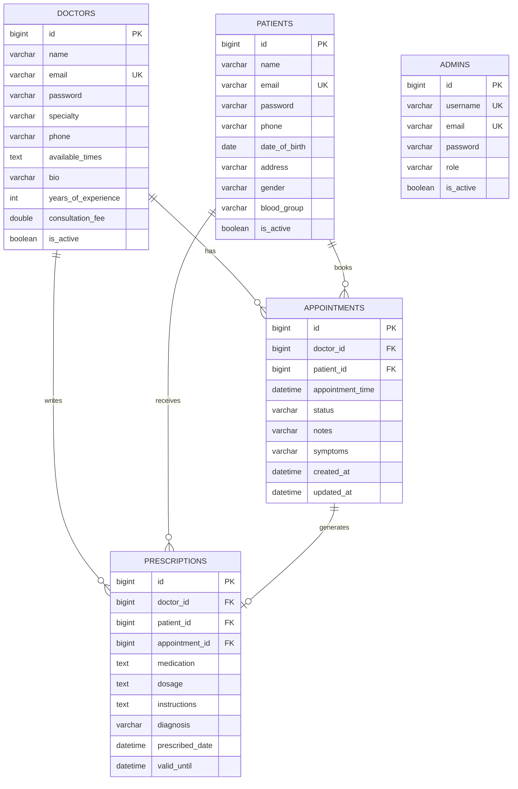

# Smart Clinic Management System - Database Schema Design

**Deliverable Q2 (5 points)**

## Overview
This document describes the MySQL database design for the Smart Clinic Management System, including table structures, relationships, and stored procedures.

---

## Database Tables

### 1. **doctors** Table
Stores information about doctors in the clinic.

| Column Name | Data Type | Constraints | Description |
|------------|-----------|-------------|-------------|
| id | BIGINT | PRIMARY KEY, AUTO_INCREMENT | Unique doctor identifier |
| name | VARCHAR(100) | NOT NULL | Doctor's full name |
| email | VARCHAR(100) | NOT NULL, UNIQUE | Doctor's email address |
| password | VARCHAR(255) | NOT NULL | Encrypted password |
| specialty | VARCHAR(100) | NOT NULL | Medical specialty |
| phone | VARCHAR(20) | NOT NULL | Contact phone number |
| available_times | TEXT | NULL | JSON string of available time slots |
| bio | VARCHAR(500) | NULL | Doctor's biography |
| years_of_experience | INT | NULL | Years of medical experience |
| consultation_fee | DOUBLE | NULL | Consultation fee amount |
| is_active | BOOLEAN | DEFAULT TRUE | Account active status |

---

### 2. **patients** Table
Stores information about patients.

| Column Name | Data Type | Constraints | Description |
|------------|-----------|-------------|-------------|
| id | BIGINT | PRIMARY KEY, AUTO_INCREMENT | Unique patient identifier |
| name | VARCHAR(100) | NOT NULL | Patient's full name |
| email | VARCHAR(100) | NOT NULL, UNIQUE | Patient's email address |
| password | VARCHAR(255) | NOT NULL | Encrypted password |
| phone | VARCHAR(20) | NOT NULL | Contact phone number |
| date_of_birth | DATE | NULL | Patient's date of birth |
| address | VARCHAR(200) | NULL | Residential address |
| gender | VARCHAR(10) | NULL | Patient's gender |
| blood_group | VARCHAR(5) | NULL | Blood group (A+, B+, etc.) |
| is_active | BOOLEAN | DEFAULT TRUE | Account active status |

---

### 3. **appointments** Table
Stores appointment bookings between doctors and patients.

| Column Name | Data Type | Constraints | Description |
|------------|-----------|-------------|-------------|
| id | BIGINT | PRIMARY KEY, AUTO_INCREMENT | Unique appointment identifier |
| doctor_id | BIGINT | NOT NULL, FOREIGN KEY → doctors(id) | Reference to doctor |
| patient_id | BIGINT | NOT NULL, FOREIGN KEY → patients(id) | Reference to patient |
| appointment_time | DATETIME | NOT NULL | Scheduled appointment date/time |
| status | VARCHAR(20) | DEFAULT 'SCHEDULED' | Status (SCHEDULED, COMPLETED, CANCELLED) |
| notes | VARCHAR(500) | NULL | Appointment notes |
| symptoms | VARCHAR(500) | NULL | Patient's symptoms |
| created_at | DATETIME | DEFAULT CURRENT_TIMESTAMP | Record creation timestamp |
| updated_at | DATETIME | NULL | Last update timestamp |

**Foreign Keys:**
- `doctor_id` REFERENCES `doctors(id)` ON DELETE CASCADE
- `patient_id` REFERENCES `patients(id)` ON DELETE CASCADE

---

### 4. **prescriptions** Table
Stores prescriptions issued by doctors to patients.

| Column Name | Data Type | Constraints | Description |
|------------|-----------|-------------|-------------|
| id | BIGINT | PRIMARY KEY, AUTO_INCREMENT | Unique prescription identifier |
| doctor_id | BIGINT | NOT NULL, FOREIGN KEY → doctors(id) | Reference to prescribing doctor |
| patient_id | BIGINT | NOT NULL, FOREIGN KEY → patients(id) | Reference to patient |
| appointment_id | BIGINT | NULL, FOREIGN KEY → appointments(id) | Reference to related appointment |
| medication | TEXT | NOT NULL | Prescribed medications |
| dosage | TEXT | NULL | Dosage instructions |
| instructions | TEXT | NULL | Additional instructions |
| diagnosis | VARCHAR(500) | NULL | Medical diagnosis |
| prescribed_date | DATETIME | DEFAULT CURRENT_TIMESTAMP | Prescription date |
| valid_until | DATETIME | NULL | Prescription expiry date |

**Foreign Keys:**
- `doctor_id` REFERENCES `doctors(id)` ON DELETE CASCADE
- `patient_id` REFERENCES `patients(id)` ON DELETE CASCADE
- `appointment_id` REFERENCES `appointments(id)` ON DELETE SET NULL

---

### 5. **admins** Table
Stores administrator user accounts.

| Column Name | Data Type | Constraints | Description |
|------------|-----------|-------------|-------------|
| id | BIGINT | PRIMARY KEY, AUTO_INCREMENT | Unique admin identifier |
| username | VARCHAR(50) | NOT NULL, UNIQUE | Admin username |
| email | VARCHAR(100) | NOT NULL, UNIQUE | Admin email address |
| password | VARCHAR(255) | NOT NULL | Encrypted password |
| role | VARCHAR(20) | DEFAULT 'ADMIN' | Admin role |
| is_active | BOOLEAN | DEFAULT TRUE | Account active status |

---

## Entity Relationship Diagram

---

## Relationships

### One-to-Many Relationships

1. **Doctor → Appointments**
   - One doctor can have many appointments
   - Foreign Key: `appointments.doctor_id` → `doctors.id`

2. **Patient → Appointments**
   - One patient can have many appointments
   - Foreign Key: `appointments.patient_id` → `patients.id`

3. **Doctor → Prescriptions**
   - One doctor can write many prescriptions
   - Foreign Key: `prescriptions.doctor_id` → `doctors.id`

4. **Patient → Prescriptions**
   - One patient can receive many prescriptions
   - Foreign Key: `prescriptions.patient_id` → `patients.id`

5. **Appointment → Prescriptions**
   - One appointment can generate one prescription (optional)
   - Foreign Key: `prescriptions.appointment_id` → `appointments.id`

---

## Stored Procedures

### 1. GetDailyAppointmentReportByDoctor
Retrieves daily appointment statistics for a specific doctor.

**Parameters:**
- `p_doctor_id` (BIGINT): Doctor's ID
- `p_date` (DATE): Report date

**Returns:** Appointment count and details for the specified doctor and date.

---

### 2. GetDoctorWithMostPatientsByMonth
Identifies the doctor with the most unique patients in a given month.

**Parameters:**
- `p_year` (INT): Year
- `p_month` (INT): Month (1-12)

**Returns:** Doctor details and patient count.

---

### 3. GetDoctorWithMostPatientsByYear
Identifies the doctor with the most unique patients in a given year.

**Parameters:**
- `p_year` (INT): Year

**Returns:** Doctor details and patient count.

---

## Indexes

For optimal query performance, the following indexes are recommended:

- `idx_doctors_email` on `doctors(email)`
- `idx_doctors_specialty` on `doctors(specialty)`
- `idx_patients_email` on `patients(email)`
- `idx_appointments_doctor_date` on `appointments(doctor_id, appointment_time)`
- `idx_appointments_patient_date` on `appointments(patient_id, appointment_time)`
- `idx_prescriptions_doctor` on `prescriptions(doctor_id)`
- `idx_prescriptions_patient` on `prescriptions(patient_id)`

---

## Database Constraints

1. **Referential Integrity**: All foreign keys enforce CASCADE on delete for appointments and prescriptions
2. **Unique Constraints**: Email addresses must be unique across doctors, patients, and admins
3. **Not Null Constraints**: Critical fields like names, emails, and passwords cannot be null
4. **Default Values**: Status fields have appropriate defaults (e.g., 'SCHEDULED', TRUE)

---

## Notes

- All passwords should be encrypted using BCrypt or similar before storage
- The `available_times` field in doctors table stores JSON-formatted time slots
- Timestamps use DATETIME type for precision
- The system supports soft deletes via `is_active` flags
